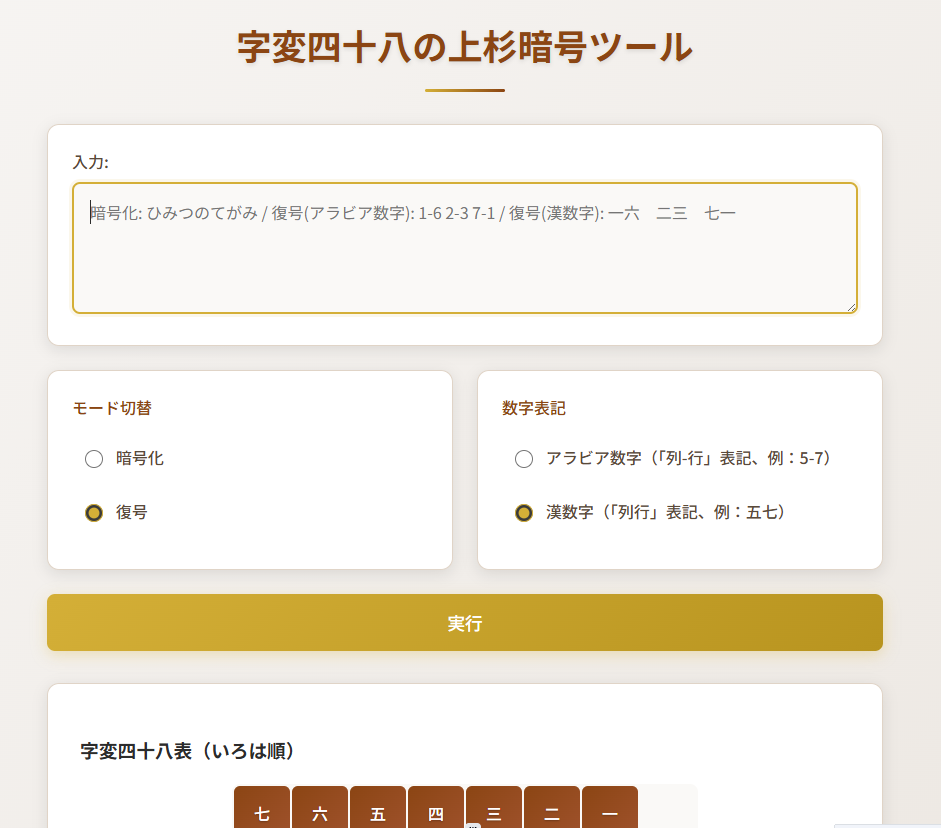

# 上杉暗号ツール（Uesugi Cipher Tool）

**Day12 - 生成AIで作るセキュリティツール100**

**上杉暗号ツール（Uesugi Cipher Tool）**は、字変四十八バージョンの上杉暗号を体験するWebツールです。

このツールは、戦国時代に宇佐美定行が記したとされる「字変四十八」方式に基づく換字式暗号を、いろは順の7×7マトリクスで再現しています。
各文字を「行番号×列番号」で暗号化・復号し、視覚的に理解できるインタフェースを提供します。

## 🌐 デモページ

👉 [https://ipusiron.github.io/uesugi-cipher/](https://ipusiron.github.io/uesugi-cipher/)

## 📸 スクリーンショット

以下は実際の画面例です。

>
>
> **

## 🔍 特徴

- 「字変四十八」方式に基づく日本語換字暗号を再現
- 7×7のいろは順マトリクスによる座標変換
- アラビア数字・漢数字の切替機能付き
- 未収録文字や記号はそのまま出力
- 暗号表に行・列番号を表示し視認性を向上
- ブラウザだけで動作、インストール不要

## 📚 歴史的背景

この暗号は、上杉謙信の家臣・宇佐美定行が軍事用に記した『武経要略』に由来する「字変四十八」方式がベースです。いろは48文字を7×7の表に並べ、文字を座標化するという仕組みは、古代ギリシャのポリュビオス暗号に類似しており、日本における歴史的な暗号文化を象徴しています。

## 🎬 登場作品

- 「暗号史の中の日本～戦国時代の『上杉暗号』～」（HH News & Reports）では、上杉謙信の家臣・宇佐美定行が『武経要略』に記した「字変四十八」として紹介されています。これは7×7の仮名表を使った換字式暗号で、語句の置き換えに数字を用いる形式とされています。
- **漫画・アニメ『Dr. Stone: Science Future』**では、上杉暗号に相当する方式がラジオ通信で使用され、敵に内容を傍受されにくくする意図で登場しています
- **学研出版『暗号サバイバル学園』**の児童向けノベルシリーズでは、シーザー暗号やモールス信号と並んで、「上杉謙信の暗号」も解読対象として登場し、子どもたちが謎解きしながら学べる構成になっています。

## 📄 ライセンス

MIT License - 詳細は [LICENSE](LICENSE) ファイルを参照してください。

## 🛠 このツールについて

本ツールは、「生成AIで作るセキュリティツール100」プロジェクトの一環として開発されました。 このプロジェクトでは、AIの支援を活用しながら、セキュリティに関連するさまざまなツールを100日間にわたり制作・公開していく取り組みを行っています。

プロジェクトの詳細や他のツールについては、以下のページをご覧ください。

🔗 [https://akademeia.info/?page_id=42163](https://akademeia.info/?page_id=42163)

