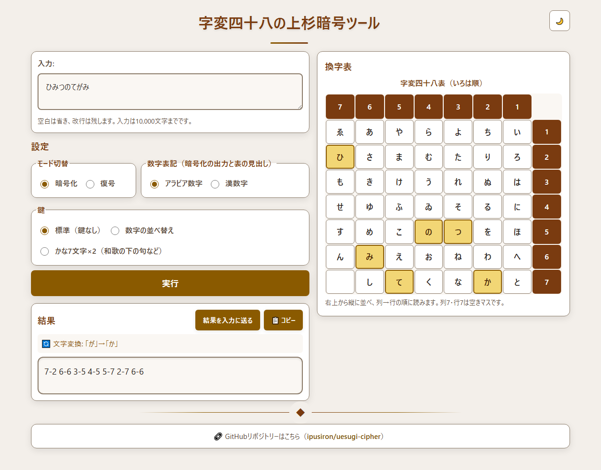
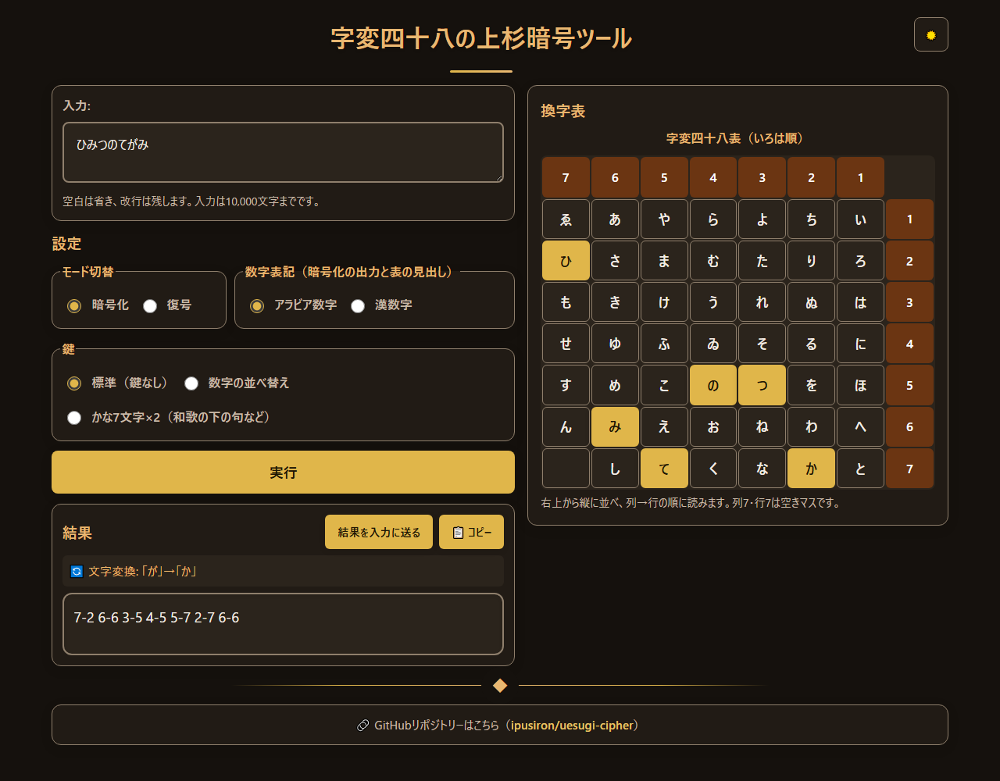
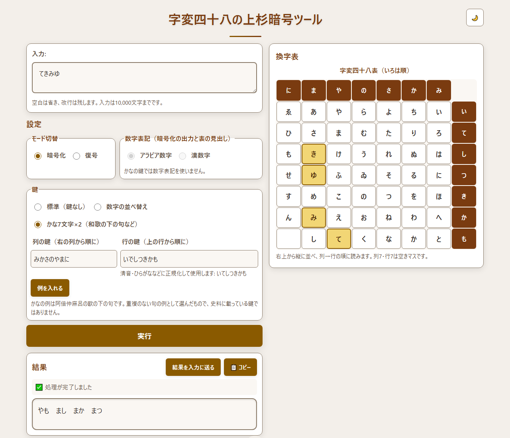

<!--
---
id: day012
slug: uesugi-cipher

title: "Uesugi Cipher Tool"

subtitle_ja: "字変四十八方式の上杉暗号を体験"
subtitle_en: "Experience the Uesugi Cipher with Jihen 48 Method"

description_ja: "字変四十八方式のいろは48文字の換字表で暗号化・復号を体験するWebツールです。数字・かなの鍵、カタカナの自動変換、ダークモードに対応します。"
description_en: "Experience encryption and decryption with the Jihen 48 iroha table, numeric or kana keys, automatic katakana conversion, and dark mode."

category_ja:
  - 古典暗号
  - 換字式暗号
category_en:
  - Classical Cryptography
  - Substitution Cipher

difficulty: 1

tags:
  - 上杉暗号
  - 換字式暗号
  - いろは順
  - 日本史
  - 古典暗号

repo_url: "https://github.com/ipusiron/uesugi-cipher"
demo_url: "https://ipusiron.github.io/uesugi-cipher/"

hub: true
---
-->

# Uesugi Cipher Tool - 字変四十八の上杉暗号ツール

[English](README.en.md) · 日本語


[](https://ipusiron.github.io/uesugi-cipher/)

**Day012 - 生成AIで作るセキュリティツール100**

上杉暗号ツールは、字変四十八方式の上杉暗号を体験するWebツールです。
いろは48文字を右上から縦に並べた7×7の表で、各文字を「列番号→行番号」に暗号化・復号します。
標準表に加えて数字・かなの鍵を選び、表のハイライトで変換を確認できるインターフェイスです。

## 🌐 デモページ

👉 [上杉暗号ツールを開く](https://ipusiron.github.io/uesugi-cipher/)

## 📸 スクリーンショット


> *ライト：標準表で「ひみつのてがみ」を暗号化し、6マスを強調*


> *ダーク：同じ結果と文字変換の通知*


> *かなの鍵：「てきみゆ」から「やも　まし　まか　まつ」へ変換*

## ✨ 機能

- 「字変四十八」方式に基づく日本語換字暗号を再現
- 7×7のいろは順マトリクスによる座標変換（右上から縦、列→行）
- 暗号化・復号の双方向変換と、結果を入力に送る往復操作
- アラビア数字（5-7）・漢数字（五七）、数字の並べ替え・かなの鍵に対応
- 濁点・半濁点・小書き・カタカナの自動変換と、未収録文字のそのまま出力
- 使用文字のハイライト（色・太い枠・太字）と、動きを抑える設定への対応
- 和風のカード構成、ライト・ダークモード
- 日本語・英語の切り替え（画面の文言のみ。いろは48文字・漢数字・かなの鍵は扱う対象なので訳しません）
- 📱 レスポンシブ対応（1024px以上は入力・結果と表の2カラム、未満は縦積み）
- 結果のコピー、入力検証と通知、実行ごとのハイライトリセット
- いろは歌の配置と暗号化・復号過程の視覚化による古典暗号の学習
- ブラウザーだけで動作、インストール不要

## 📖 使い方

1. 入力欄に「てきみゆ」を入れる。
2. 暗号化・アラビア数字・標準（鍵なし）を選び、「実行」を押す。
3. 「5-7 6-3 6-6 6-4」と表のハイライトを確認する。
4. 「結果を入力に送る」を押して、復号結果「てきみゆ」を確認する。

数字表記や鍵を変えると、入力があり鍵が正しい場合は自動で再実行します。モードだけを変えた場合は前の結果とハイライトを消します。

平文の空白は、座標の区切りと見分けがつかないため暗号文に出しません。改行は保持します。入力上限はコードポイントで10,000文字です。

復号はアラビア数字・漢数字のどちらでも、全角でも受け付けます。漢数字は「五七六三六六六四」のように区切りなしでも復号できます。空きマス（7-7）と範囲外は「?」になり、座標として読めないトークンは区切りを足さずにそのまま出力して通知します。

### 使用例

| 平文 | 変換後 | アラビア数字 | 漢数字 |
|---|---|---|---|
| てきみゆ | てきみゆ | 5-7 6-3 6-6 6-4 | 五七　六三　六六　六四 |
| ひみつのてがみ | ひみつのてかみ | 7-2 6-6 3-5 4-5 5-7 2-7 6-6 | 七二　六六　三五　四五　五七　二七　六六 |
| おこのみやき | おこのみやき | 4-6 5-5 4-5 6-6 5-1 6-3 | 四六　五五　四五　六六　五一　六三 |
| ありがとう | ありかとう | 6-1 2-2 2-7 1-7 4-3 | 六一　二二　二七　一七　四三 |
| がんばって | かんはつて | 2-7 7-6 1-3 3-5 5-7 | 二七　七六　一三　三五　五七 |
| ぷるぷる | ふるふる | 5-4 2-4 5-4 2-4 | 五四　二四　五四　二四 |
| こんにちは | こんにちは | 5-5 7-6 1-4 2-1 1-3 | 五五　七六　一四　二一　一三 |
| テキミユ | てきみゆ | 5-7 6-3 6-6 6-4 | 五七　六三　六六　六四 |
| らーめん | らめん | 4-1 6-5 7-6 | 四一　六五　七六 |

## 🔑 鍵つきモード

列の鍵は右の列から、行の鍵は上の行から割り当てます。標準は両方とも「1234567」です。数字の並べ替えは7!×7!＝25,401,600通りです。「ランダムに作る」はブラウザーの乱数を使い、剰余の偏りを避けて並べ替えます。

かなの鍵は、いろは48文字から重複しない7文字を選びます。1句の中で文字が重なると復号が一意に決まらないので、「つゆにぬれつつ」「あまのかぐやま」は使えません。濁点などは清音に正規化してから重複を検査します。

かなの例「みかさのやまに／いでしつきかも」は阿倍仲麻呂の歌の下の句で、重複のない句の例として選んだものです。史料に載っている鍵ではありません。行の鍵は「いてしつきかも」として使用します。

| 鍵 | 列の鍵 | 行の鍵 |
|---|---|---|
| K1 | 3147526 | 2615374 |
| K2 | みかさのやまに | いてしつきかも |

| 鍵 | 平文 | アラビア数字またはかな | 漢数字またはかな |
|---|---|---|---|
| K1 | てきみゆ | 5-4 2-1 2-7 2-5 | 五四　二一　二七　二五 |
| K1 | ひみつのてがみ | 6-6 2-7 4-3 7-3 5-4 1-4 2-7 | 六六　二七　四三　七三　五四　一四　二七 |
| K2 | てきみゆ | やも　まし　まか　まつ | やも　まし　まか　まつ |
| K2 | ひみつのてがみ | にて　まか　さき　のき　やも　かも　まか | にて　まか　さき　のき　やも　かも　まか |
| K2 | いろは | みい　みて　みし | みい　みて　みし |

かなの鍵の暗号文は「やもましまかまつ」のように区切りなしでも復号できます。かなの鍵では数字表記を使わないため、数字表記の設定は無効になります。鍵は保存せず、URLにも載せません。

## 🔄 自動文字変換

いろは歌には濁点・半濁点・促音が含まれていないため、現代日本語の「が」「ぷ」「っ」などの文字はそのままでは暗号化できません。
本ツールでは、これらの文字を自動的に対応する清音に変換してから暗号化を行います。

### 自動変換の表

#### 濁点 → 清音

| 濁点文字 | 変換後 | 濁点文字 | 変換後 | 濁点文字 | 変換後 |
|---------|-------|---------|-------|---------|-------|
| が | か | ざ | さ | だ | た |
| ぎ | き | じ | し | ぢ | ち |
| ぐ | く | ず | す | づ | つ |
| げ | け | ぜ | せ | で | て |
| ご | こ | ぞ | そ | ど | と |

| 濁点文字 | 変換後 |
|---------|-------|
| ば | は |
| び | ひ |
| ぶ | ふ |
| べ | へ |
| ぼ | ほ |

#### 半濁点 → 清音

| 半濁点文字 | 変換後 |
|-----------|-------|
| ぱ | は |
| ぴ | ひ |
| ぷ | ふ |
| ぺ | へ |
| ぽ | ほ |

#### その他の文字

| 文字 | 変換後 | 説明 |
|-----|-------|------|
| っ | つ | 促音（小さい「つ」） |
| ー | （削除） | 長音記号 |
| ゃ | や | 小さい「や」 |
| ゅ | ゆ | 小さい「ゆ」 |
| ょ | よ | 小さい「よ」 |
| ぁ | あ | 小さい「あ」 |
| ぃ | い | 小さい「い」 |
| ぅ | う | 小さい「う」 |
| ぇ | え | 小さい「え」 |
| ぉ | お | 小さい「お」 |
| ゔ | う | 濁点付きの「う」 |
| ゎ | わ | 小さい「わ」 |
| ゕ | か | 小さい「か」 |
| ゖ | け | 小さい「け」 |
| カタカナ | ひらがな | 例：テ→て |
| 半角カタカナ | 清音のひらがな | NFKCで正規化後に変換（例：ｶﾞ→か） |

### 📝 使用例

#### 例1: 基本的な濁点変換

```
入力: ありがとう
変換: ありかとう
暗号化結果: 6-1 2-2 2-7 1-7 4-3
変換通知: 🔄 文字変換: 「が」→「か」
```

#### 例2: 複数文字の変換

```
入力: がんばって
変換: かんはつて
暗号化結果: 2-7 7-6 1-3 3-5 5-7
変換通知: 🔄 文字変換: 「が」→「か」、「ば」→「は」、「っ」→「つ」
```

#### 例3: 半濁点の変換

```
入力: ぷるぷる
変換: ふるふる
暗号化結果: 5-4 2-4 5-4 2-4
変換通知: 🔄 文字変換: 「ぷ」→「ふ」×2
```

## ⚠️ 注意事項

### 復号時の考慮点

- 復号結果は変換後の清音で表示
- 元の濁点・半濁点は復元不可
- 例：「がんばって」→暗号化→復号→「かんはつて」

### 意味の変化

一部の文字変換により、意味が変わる場合があります。

| 元の語 | 読み | 変換後の読み | 影響 |
|---|---|---|---|
| 時間 | じかん | しかん | 「歯科ん」のような音になる |
| 頑張って | がんばって | かんはつて | 意味が読み取りにくくなる |
| ラーメン | らーめん | らめん | 長音が消える |

### 推奨事項

- **学習・体験目的**: 文字変換機能により現代日本語も体験可能
- **歴史的再現**: より正確な体験には、変換が発生しない文章の使用を推奨
- **重要文書**: 現代暗号の使用を強く推奨

### 🎯 対応範囲

✅ **対応済み**

- 基本的な濁点・半濁点（か行、さ行、た行、は行）
- 促音（っ）
- 長音（ー）
- 拗音・小書き文字（ゃ、ゅ、ょ、ぁ、ぃ、ぅ、ぇ、ぉ）
- カタカナ・半角カタカナは清音のひらがなに変換

漢字・英数字・記号類はそのまま出力して通知します。変換前の濁点や長音、空白は復元できません。

## 📚 歴史的背景

この暗号は、上杉謙信の家臣・宇佐美定行が記したと伝えられる兵法書『武経要略』の「行間篇」に載るとされる「字変四十八」方式がベースです。
いろは48文字を7×7の表に並べ、文字を座標化するという仕組みは、古代ギリシャで記録された「ポリュビオス方陣」と同じ発想であり、日本における歴史的な暗号文化を象徴しています。

ただし、ポリュビオスが『歴史』第10巻に記したのは、秘密を守るための暗号ではなく、松明による信号の方法でした。
ギリシャ語の24文字を5枚の板に分け、衝立で仕切った左右の空間に松明を立てて、「何枚目の板か」と「その板の何番目の文字か」を伝えます。
いま「ポリュビオス方陣」と呼ばれる5×5の表は、ラテン文字を25マスに収めるためにできた後世の形で、その呼び名自体も後世のものです。
字変四十八と似ているのは「文字を座標の組で表す」という発想であって、古代ギリシャの暗号をまねたものではありません。
ポリュビオスの方法は [Polybius CipherLab](https://ipusiron.github.io/polybius-cipherlab/) で確かめられます。

### 出典と人物についての補足

字変四十八は、上杉謙信の軍師・宇佐美定行が『武経要略』に記した暗号として紹介されてきました。ただし、この伝承には次の留保があります。

- 宇佐美定行は、一次史料では存在を確認できない人物とされている。実在の越後の武将・宇佐美定満をモデルに、江戸時代の軍記のなかで作られた人物像だと考えられている（新沢1971、高橋1997・2007）
- 定行の活躍を伝える『北越軍記』は、紀州藩の軍学者・宇佐美定祐（1634〜1713年）の作と考えられている（高橋1997・2007）。定祐は初め大関姓を名乗り、貞享元年（1684年）に藩命で宇佐美姓に改めた（井上2020）。定祐が上杉謙信の感状などの文書を作ったと論じる研究もある（遊佐2007・2008）
- 『武経要略』は、国書データベース（国文学研究資料館）では分類が「兵法」、著者が宇佐美良賢（勝興）とされている。勝興（1590〜1647年）は定祐の父で、江戸時代前期の兵法家である（『日本人名大辞典』）。年紀のわかる伝本は、寛文6年（1666年）写・天和3年（1683年）写・天保15年（1844年）写など江戸時代のものが中心である。目録には天文5年（1536年）写とされる伝本も載るが、著者とされる勝興の生年より前の年紀であり、成立年代は確定していない

つまり字変四十八は、「上杉謙信の軍師の作」と伝えられてきた一方で、出典とされる『武経要略』は、江戸時代前期の越後流軍学者の著作として目録に載る兵法書です。謙信の時代に実際に使われたことを示す一次史料は、本ツールの作成にあたって調べた範囲では確認できていません。上杉暗号・字変四十八そのものを主題にした学術論文も、CiNii Researchでは見つかりませんでした（2026年9月検索）。

## 🎬 上杉暗号が登場する作品

- 「暗号史の中の日本～戦国時代の『上杉暗号』～」（HH News & Reports）では、上杉謙信の家臣・宇佐美定行が『武経要略』に記した「字変四十八」として紹介されています。これは7×7の仮名表を使った換字式暗号で、語句の置き換えに数字を用いる形式とされています。
- 漫画・アニメ『Dr. Stone: Science Future』では、上杉暗号に相当する方式がラジオ通信で使用され、敵に内容を傍受されにくくする意図で登場しています。
- 学研出版『暗号サバイバル学園』の児童向けノベルシリーズでは、シーザー暗号やモールス信号と並んで、「上杉謙信の暗号」も解読対象として登場し、子どもたちが謎解きしながら学べる構成になっています。

## 🔬 安全性分析

### 🔒 暗号方式の分類と基本特性

**暗号タイプ**: 単換字暗号（monoalphabetic substitution cipher）

- 各ひらがな文字が固定の座標ペア（例：「て」→「5-7」）に1対1対応
- 文字の置換関数が一定で変化しない

### ⚠️ 主要な脆弱性

#### 1. **頻度分析攻撃**

```
日本語の文字頻度（例）：
「の」「に」「は」「を」→ 高頻度
「ゑ」「ゐ」→ 現代では使用頻度極低

暗号文でも同じパターンが残る：
頻出する座標 → 「の」「に」「は」の可能性大
```

#### 2. **パターン分析**

- 同一文字の反復：「ここ」→「5-5 5-5」
- 語尾パターン：「です」「ます」の座標パターン
- 助詞の固定パターン：「は」「が」「を」の座標

#### 3. **鍵空間の問題**

標準の表はいろは歌の配置が固定で、実質的に鍵はありません。座標の読み方（列-行vs行-列）程度の違いしかない方式です。

鍵つきモードで数字の鍵空間を25,401,600通りに増やしても、単換字であることは変わりません。同じ文字は同じ座標になるため、頻度分析とパターン分析にはそのまま弱い方式です。重要な情報の保護には使わないでください。

### 🎯 具体的な攻撃シナリオ

#### **短文の場合（10-20文字）**

```
暗号文: 「5-7 6-3 6-6 6-4」
↓
1. 4文字の短い単語を推測
2. 「○○○○」パターンの日本語を辞書検索
3. 「てきみゆ」「ひみつの」等の候補
4. 1つでも当たれば4文字分の対応表が判明
```

#### **長文の場合（100文字以上）**

```
1. 頻度分析で「の」「に」「は」の座標を特定
2. パターン分析で語尾「ます」「です」を特定
3. 徐々に対応表を復元
4. 残りの文字を辞書攻撃で確定
```

## 🔒 セキュリティとプライバシー

ツールの画面は外部へのリクエストが0件で、入力・結果・鍵を送信しません。Google Fontsを含む外部リソースは読み込みません。ブラウザーに保存するのはテーマ設定と言語の選択だけです。

CSPをmetaで設定し、インラインスクリプト・インラインスタイルを使わず、通信をconnect-src 'none'で禁止しています。表示はtextContentとDOM構築で行い、鍵の種類・文字数・重複も検査します。referrerはno-referrer、外部リンクはnoopener noreferrerです。

metaではframe-ancestorsが無効なため設定していません。READMEのバッジや外部リンク先はツール本体とは別です。

## 🧪 テスト

Node 22以上で、リポジトリーのルートから実行します。依存パッケージはありません。

```sh
npm test
```

node --testで既知解答・48文字の往復・鍵・入力境界・配色・HTMLを検証します。日英の辞書はキーの集合・差し込みの名前・訳し忘れの和文を照合し、対応表に触れていないことも縛ります。READMEの表と例も再計算し、GitHub Actionsのpushとpull_requestで自動実行します。

## 🔗 参考

### Web

- HH News & Reports「暗号と暗号史」第3回「暗号史の中の日本～戦国時代の『上杉暗号』～」 https://www.hummingheads.co.jp/reports/series/ser01/110519.html
- マイナビ TECH+「ゼロからはじめてみる日本語プログラミング『なでしこ』」第74回 https://news.mynavi.jp/techplus/article/nadeshiko-74/
- Polybius CipherLab（Day067）— ポリュビオスの原典（『歴史』第10巻の松明信号）と、後世の5×5の方陣を扱う https://ipusiron.github.io/polybius-cipherlab/

### 文献・目録

- 新沢佳大「宇佐美駿河守の虚像とその実像」『日本歴史』276号、吉川弘文館、1971年、104〜110頁
- 高橋修「軍学者宇佐美定祐について―紀州本川中島合戦図屏風の周辺―」『和歌山県立博物館研究紀要』2号、1997年、22〜32頁
- 高橋修『【異説】もうひとつの川中島合戦―紀州本「川中島合戦図屏風」の発見』洋泉社、2007年
- 遊佐教寛「カミソリで「下文」に虫食い穴を作った男―紀州藩越後流軍学者宇佐美定祐文書を解きほぐす」『和歌山県立文書館紀要』12号、2007年、1〜30頁
- 遊佐教寛「その謙信「感状」は紀州藩軍学者宇佐美定祐が作った」『和歌山県立文書館紀要』13号、2008年、25〜62頁
- 井上泰至「寛文期の武家社会と織豊関係編纂物軍記―宇佐美定祐『増補朝鮮征伐記』を中心に―」『書物・出版と社会変容』24号、2020年、1〜30頁 https://hdl.handle.net/10086/31056
- 国書データベース（国文学研究資料館）『武経要略』（著作ID 1015050） https://kokusho.nijl.ac.jp/biblio/100428794
- 『デジタル版 日本人名大辞典+Plus』「宇佐美勝興」（講談社） https://kotobank.jp/word/宇佐美勝興-1057625

## 📁 ディレクトリー構造

```text
uesugi-cipher/
├── README.md                  # この説明
├── README.en.md               # 英語版の説明
├── CLAUDE.md                  # 開発時の構成と決まり
├── LICENSE                    # MITライセンス
├── package.json               # 依存なしのnpm test
├── docs/                      # Pagesで配信する範囲
│   ├── index.html             # 入力・設定・結果・表
│   ├── favicon.svg            # ローカルアイコン
│   ├── css/
│   │   └── style.css          # 配色・レスポンシブ表示
│   └── js/
│       ├── uesugi-logic.js    # DOMに依存しない暗号ロジック
│       ├── i18n.js            # 日本語と英語の文言と切り替え
│       └── script.js          # DOM・テーマ・コピー
├── assets/
│   ├── screenshot.png         # 保存している旧画像
│   ├── screenshot2.png        # ライトの標準表
│   ├── screenshot3.png        # ダークの標準表
│   └── screenshot4.png        # かなの鍵
├── test/
│   ├── uesugi.test.js         # 標準表・変換・境界
│   ├── key.test.js            # 鍵・シャッフル・往復
│   ├── readme.test.js         # 文書・画像参照の一致
│   ├── html.test.js           # HTML・安全な描画
│   ├── i18n.test.js           # 辞書とdata-i18nの照合
│   ├── contrast.test.js       # CSSから配色を計算
│   └── format.test.js         # 可読な行長・行数
└── .github/
    └── workflows/
        ├── deploy.yml        # docs/だけをPagesへ配信
        └── test.yml          # Node 22で自動テスト
```

## 💻 動作環境

モダンブラウザーで動きます。ローカルではdocs/index.htmlを直接開くfile://でも使用できます。HTTPで配信する場合は、次を実行して表示されたローカルURLを開いてください。

```sh
python -m http.server --directory docs
```

Node 22以上はテスト時のみ必要です。コピーはブラウザーのClipboard APIの利用条件に従い、使えない場合は結果を選択してコピーしてください。

## 📄 ライセンス

MIT License - 詳細は [LICENSE](LICENSE) ファイルを参照してください。

## 🛠 このツールについて

本ツールは、「生成AIで作るセキュリティツール100」プロジェクトの一環として開発されました。 このプロジェクトでは、AIの支援を活用しながら、セキュリティに関連するさまざまなツールを100日間にわたり制作・公開していく取り組みを行っています。

プロジェクトの詳細や他のツールについては、以下のページをご覧ください。

🔗 [https://akademeia.info/?page_id=42163](https://akademeia.info/?page_id=42163)
